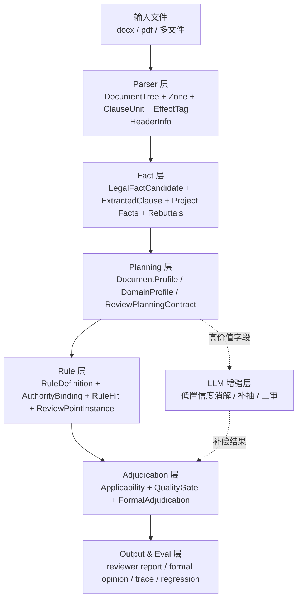

# agent_review 主链收敛重构方案 v1

## 一、总体判断

当前 `agent_review` 主链已经具备可运行能力，但存在一个明显问题：

不是“能力不够”，而是“判断分散、层次重复、主链过重”。

典型表现包括：

- 同一问题在 `parser / extractor / applicability / quality gate / formal` 多层重复判断。
- 同类语义分散在不同模块中，边界不够稳定。
- 一部分问题先进入主链，再在 formal 阶段压掉，导致链路负担偏重。
- `review_point_catalog`、`RuleHit`、`ReviewPointInstance`、`ReviewPoint` 之间仍有并行和重叠。
- 输出层承接了过多“二次裁判”责任。

因此，下一阶段不应继续横向堆模块，而应做一次“主链收敛”。

收敛目标不是简单减少层数，而是：

1. 每层只做一件事
2. 每个判断尽量只做一次
3. 证据与裁判职责分离
4. 让未知文件主线更稳，而不是更重

## 二、收敛原则

### 1. 保留必要复杂度

政府采购招标文件天然存在这些不可省略的复杂度：

- 文档结构复杂
- 条款语义受上下文控制
- 模板、附件、政策说明大量混入正文
- 同一法律问题需要证据、法理、适用前提同时成立
- 未知品目和未知结构不能依赖预设专项规则

所以主链必须保留：

- 结构理解
- 事实抽取
- 规则裁判
- 适法性与证据质量控制
- 报告输出

### 2. 消除重复复杂度

下一阶段要重点消除的是这些重复复杂度：

- 同一句话在多个阶段重复做“是不是有效条款”的判断
- 同一个审查点同时被 `risk hit`、`consistency`、`review point catalog` 多路并行命中
- 输出层再次承担规则判断
- `LLM` 参与过宽，干扰 deterministic 主链

### 3. 让主链围绕“法律事实”而不是“关键词命中”运转

后续主链应以这条链为核心：

`DocumentTree -> ClauseUnit -> LegalFactCandidate -> RuleHit -> ReviewPointInstance -> FormalAdjudication`

也就是说：

- parser 输出的是结构化语义单元
- rule 层消费的是法律事实
- formal 消费的是规则实例和证据质量
- 报告只消费正式裁判结果

## 三、当前层次处理建议

### 应保留的层

#### 1. Parser 层

保留，且继续作为主链入口。

保留内容：

- `document loader / docx parser / pdf parser / OCR`
- `document tree building`
- `zone classification`
- `ClauseUnit building`
- `effect tagging`
- `header info resolve`

保留原因：

- 未知文件处理能力首先取决于 parser 是否能稳定产出结构骨架。
- 如果 parser 不稳，后面的 rule、formal、LLM 都会被迫承担补锅职责。

#### 2. Fact 层

保留，但要明确为独立语义层。

保留内容：

- `ExtractedClause`
- `LegalFactCandidate`
- 结构化字段抽取
- 项目事实、反证、模板、条件政策等区分

保留原因：

- 审查点不应直接吃原始文本碎片，而应消费已归一化的事实对象。

#### 3. Rule 层

保留，且要变成主裁判入口。

保留内容：

- `RuleDefinition`
- `AuthorityBinding`
- `RuleHit`
- `ReviewPointInstance`

保留原因：

- 这一层最适合承载“法理条件是否成立”的判断。

#### 4. Adjudication 层

保留，但要收窄职责。

保留内容：

- `ApplicabilityCheck`
- `ReviewQualityGate`
- `FormalAdjudication`

保留原因：

- 必须有一层负责“适用前提 + 证据质量 + 是否进入正式输出”的最终裁判。

#### 5. Output / Eval 层

保留。

保留内容：

- `reporting`
- `artifacts`
- `trace`
- `unknown sample regression`
- `baseline diff`

保留原因：

- harness engineering 要求过程可观察、可回归、可比较。

### 应合并的层

#### 1. `ExtractedClause` 与 `LegalFactCandidate` 的语义重叠部分

处理建议：

- 不删除两者
- 但要明确：
  - `ExtractedClause` 负责“结构化字段视角”
  - `LegalFactCandidate` 负责“法律事实视角”
- 相同语义不要在两边重复再造

收敛方向：

- `ClauseUnit -> LegalFactCandidate`
- 必要时从 `LegalFactCandidate` 投影出 `ExtractedClause`

#### 2. `risk rules` 与 `consistency checks` 中的业务判断

处理建议：

- 逐步把真正的业务判断合并回 `RuleDefinition / RuleHit`
- `consistency checks` 降为轻量辅助视图

收敛方向：

- 一致性问题优先作为正式规则实例产生
- `consistency checks` 只输出概览，不单独定义核心裁判

#### 3. `review_point_catalog` 与新链的任务激活职责

处理建议：

- `review_point_catalog` 从“中心裁判入口”降为“任务注册表”
- `ReviewPointContract + RuleDefinition` 接管主激活权

收敛方向：

- 激活逻辑以 `RuleDefinition / ReviewPlanningContract` 为主
- `review_point_catalog` 保留兼容入口与展示元数据

### 应降权的层

#### 1. Output 层中的二次裁判

处理建议：

- 报告层不再做额外业务判断
- 只渲染 formal 结果与 trace

#### 2. `quality gate` 中的业务判断

处理建议：

- `quality gate` 只保留：
  - 模板污染过滤
  - 弱证据阻断
  - 重复合并
  - 明显错区纠偏
- 不再承担规则本体判断

#### 3. LLM 在 parser 与裁判中的参与范围

处理建议：

- parser 主体不依赖 LLM
- LLM 只作为：
  - 低置信度语义消解器
  - 高价值字段补抽器
  - 二审纠偏器

#### 4. `risk_hit` 的直接正式输出权

处理建议：

- `risk_hit` 仅作为早期命中信号
- 正式结论必须尽量走：
  - `RuleHit -> ReviewPointInstance -> FormalAdjudication`

## 四、收敛后的精简主链

## 五、各层边界定义

### 1. Parser 层

输入：

- 原始文件

输出：

- `DocumentNode`
- `SemanticZone`
- `ClauseUnit`
- `EffectTag`
- `HeaderInfo`

不负责：

- 风险定性
- 审查点成立判断

### 2. Fact 层

输入：

- `ClauseUnit`

输出：

- `LegalFactCandidate`
- `ExtractedClause`
- `project facts / negative facts / template facts / conditional facts`

不负责：

- 最终风险定性

### 3. Planning 层

输入：

- `DocumentProfile`
- `DomainProfile`
- `ClauseUnit / LegalFactCandidate`

输出：

- `ReviewPlanningContract`
- 激活的 review families
- extraction demands

不负责：

- 最终裁判

### 4. Rule 层

输入：

- `LegalFactCandidate`
- `ReviewPlanningContract`
- `AuthorityBinding`

输出：

- `RuleHit`
- `ReviewPointInstance`

不负责：

- 输出格式
- 报告渲染

### 5. Adjudication 层

输入：

- `ReviewPointInstance`
- 证据包
- 反证
- 法条绑定

输出：

- `confirmed_issue`
- `warning`
- `missing_evidence`
- `manual_review_required`

不负责：

- 重新发明规则

### 6. Output / Eval 层

输入：

- `FormalAdjudication`
- `trace`
- `artifacts`

输出：

- reviewer 报告
- formal 审查意见
- regression 结果

不负责：

- 再次判断问题是否成立

## 六、重构落点

### 需要继续强化的主干

- `ClauseUnit -> LegalFactCandidate`
- `LegalFactCandidate -> RuleHit`
- `RuleHit -> ReviewPointInstance`
- `ReviewPointInstance -> FormalAdjudication`

### 需要逐步退场的旧主干

- `全文关键词命中 -> risk hit -> 直接上 formal`
- `review_point_catalog` 同时承担激活、规则、输出三重责任
- `consistency checks` 承担核心业务裁判

### 需要保留但弱化的能力

- `risk_rules.py`
- `consistency/checks.py`
- 报告层中的策略性压制

这些能力后续应更多服务于：

- fallback
- trace
- 调试与对照

而不是正式主裁判。

## 七、预期收益

重构完成后，主链会获得这些收益：

1. 未知文件处理更稳
- parser 输出稳定骨架，减少后段补锅

2. 模板误报更低
- 模板、条件政策、反证在 fact 层被更早识别

3. 规则更可维护
- 裁判集中在 rule / adjudication 层

4. LLM 更可控
- 只在高价值节点介入

5. 回归更清晰
- 每一层都有明确输入输出，可以做分层 regression

## 八、实施结论

下一阶段的主线不是继续“加功能”，而是：

`以 LegalFactCandidate / RuleHit / ReviewPointInstance 为中轴，收敛 parser、规则、formal、输出之间的边界。`

也就是说：

- 保留 Parser / Fact / Rule / Adjudication / Output 五层主链
- 合并重复判断
- 降权旧式关键词直出链
- 收窄 LLM 参与范围

后续所有开发，应优先服务这条精简主链，而不是继续平行增加旁路逻辑。
