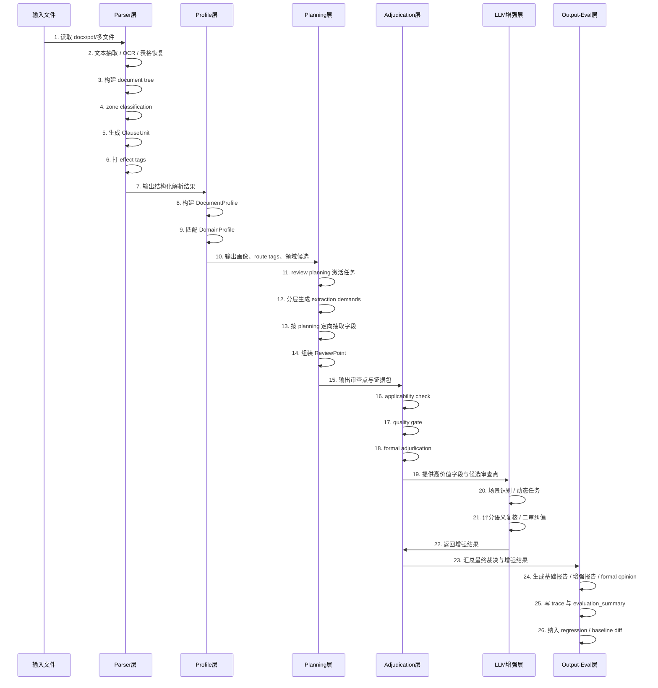
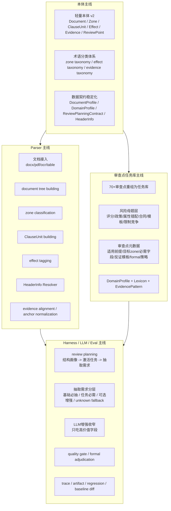

# agent_review 下一阶段架构与流程设计 v1

## 总体判断

这件事不能再按“先写规则，再补例外”的方式做。

在当前运行环境里，真正可行的路线应该是：

`轻量本体作为稳定语义骨架 + parser 负责把未知文件转成结构化对象 + harness engineering 负责把复杂审查任务拆成可控阶段 + 70多个审查点作为任务库而不是硬编码规则集 + LLM只在高价值、不确定、未知场景中参与`

也就是说，后面要规划的重点不是单纯继续堆 parser 或继续堆规则，而是把这 4 层统一起来：

1. 本体层
2. 结构解析层
3. 审查任务编排层
4. 输出与评测闭环层

## agent_review 当前主链流程图 v1（分层版）

```mermaid
flowchart TD
    subgraph P1["Parser 层"]
        A["输入文件<br/>docx / pdf / 多文件"]
        B["Document Ingestion<br/>文本抽取 / OCR / 表格恢复 / 元数据"]
        C["Document Tree Building<br/>document nodes / section anchors / table blocks"]
        D["Zone Classification<br/>资格 / 技术 / 评分 / 商务 / 合同 / 模板 / 附件 / 其他"]
        E["ClauseUnit Building<br/>条款单元切分 + 原文定位"]
        F["Effect Tagging<br/>条款效力 / 作用域 / 模板污染 / 附件依赖"]
    end

    subgraph P2["Profile 层"]
        G["DocumentProfile<br/>项目属性倾向 / 结构特征 / 模板污染 / unknown signals"]
        H["DomainProfile Matching<br/>领域候选 / lexicon / evidence patterns / route tags"]
    end

    subgraph P3["Planning 层"]
        I["Review Planning<br/>结构画像 -> 激活任务"]
        J["Extraction Demands Layering<br/>基础必抽 / 任务增强 / unknown fallback"]
        K["Planning-guided Extraction<br/>按任务定向抽取高价值字段"]
        L["ReviewPoint Assembly<br/>证据组装 / catalog映射 / 风险母题归并"]
    end

    subgraph P4["Adjudication 层"]
        M["Applicability Check<br/>该问题在本文件是否适用"]
        N["Quality Gate<br/>模板误报压制 / 证据充分性 / 重复过滤 / 区域纠偏"]
        O["Formal Adjudication<br/>confirmed_issue / warning / missing_evidence / manual_review_required"]
        P["LLM Enhancement<br/>场景识别 / 动态任务 / 二审纠偏 / 摘要增强"]
    end

    subgraph P5["Output & Eval 层"]
        Q["Final Review Report<br/>基础报告 / 增强报告 / formal opinion"]
        R["Artifacts & Trace<br/>evaluation_summary / enhancement_trace / review_point_trace"]
        S["Regression & Eval<br/>unknown sample regression / baseline diff / Sprint闭环"]
    end

    A --> B --> C --> D --> E --> F
    F --> G --> H
    H --> I --> J --> K --> L
    L --> M --> N --> O
    O --> P --> Q --> R --> S
```

## agent_review 当前主链时序图 v1

## 《agent_review 下一阶段总体规划图 v1》

## 设计要点

### 本体主线

- 目标：提供统一语义骨架，而不是重知识图谱。
- 重点：`zone`、`effect`、`evidence`、`review point`、`formal disposition` 五套 taxonomy。
- 原则：先服务 parser、planning、adjudication 的数据契约，再补领域扩展。

### parser 主线

- 目标：让未知文件先被稳定理解，而不是直接套规则。
- 重点：`document tree`、`zone classification`、`ClauseUnit`、`effect tagging`、`HeaderInfo Resolver`。
- 原则：parser 负责切准语义边界和定位锚点，不直接做 formal 定性。

### 审查点任务库主线

- 目标：把 70+ 审查点从“规则列表”重组为“任务库”。
- 重点：风险母题层、审查点元数据、适用前提、反证模板、领域词典。
- 原则：新品目优先扩充 `DomainProfile / Lexicon / EvidencePattern`，不复制专项主干。

### harness / LLM / eval 主线

- 目标：把阶段编排、LLM 增强、trace 和 baseline 回归收成一条稳定主链。
- 重点：`review planning`、抽取需求分层、LLM 窄上下文、quality gate、formal adjudication、evaluation summary。
- 原则：先 deterministic，再 LLM；先 applicability，再 formal；无法闭合证据链时优先转人工。
