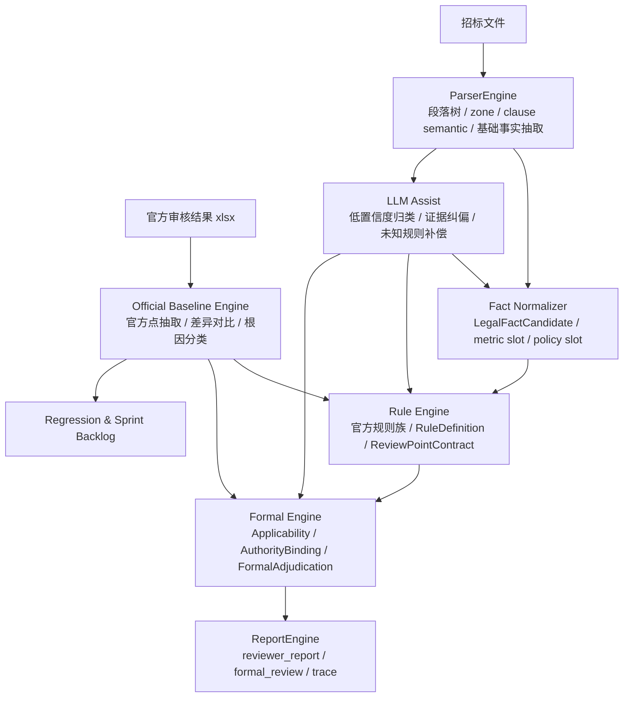

# agent_review 官方样本驱动重整方案 v1

## 1. 为什么要重整

当前 `agent_review` 已具备：

- 文档解析能力
- 段落树与 zone / clause semantic 能力
- 一批正式审查点
- formal adjudication / reviewer report 输出链

但和“官方审核结果文件”对照后，暴露出三个结构性问题：

1. parser 已经能看到不少原文，但没有稳定进入正式规则链。
2. 审查点标题、规则、法条、事实槽位之间仍存在错位。
3. LLM 主要在后置增强链，未作为“规则缺口补偿器”前移。

所以后续如果会持续出现“招标文件 + 官方审核结果”的成对样本，最优做法不是继续逐文件散补，而是改成：

`官方样本 -> 规则收口 -> 主链重构 -> 回归评测`

## 2. 重整目标

目标不是推倒重来，而是把现有三引擎结构收成一条更稳的主链：

- `ParserEngine`
- `ComplianceEngine`
- `ReportEngine`

并让“官方样本”成为下一阶段的事实来源和回归基线。

## 3. 新主链

## 4. 四条主线

### 4.1 官方样本主线

目标：把“官方审核结果 xlsx”从参考材料变成正式输入。

需要新增：

- `OfficialReviewBaseline`
- `OfficialGapAnalysis`
- `official_gap_analysis.py`

输出内容：

- 官方点总数
- 当前完全命中 / 部分命中 / 漏检
- 当前误报/弱报
- 根因分布
- Sprint 修复建议

### 4.2 规则主线

目标：把官方规则正式沉淀成规则族，而不是继续靠宽泛 review point 吸收。

优先规则族：

- 资格公平性
  - 组织形式限制
  - 所有制/注册地/所在地限制
  - 隐性规模条件证书
- 评审规则合规性
  - 注册资本评分
  - 营业收入评分
  - 利润评分
  - 股权结构评分
  - 成立/经营年限评分
  - 准入类证书评分
  - 特定认证范围
  - 价格分权重下限
- 内容规范性
  - 服务期限超过 36 个月
  - 付款时限

### 4.3 事实槽位主线

目标：把 parser 看到的原文，规范投影成更细粒度的法律事实。

优先新增槽位：

- `supplier_restriction_kind`
- `entity_form_restriction`
- `qualification_certificate_kind`
- `scoring_metric_name`
- `scoring_metric_category`
- `metric_threshold`
- `shareholding_requirement`
- `certification_scope_requirement`
- `price_weight_percent`
- `service_duration_months`
- `payment_deadline_days`
- `payment_deadline_working_days`

### 4.4 LLM 补偿主线

目标：让 LLM 从“末端增强”前移为“低置信度补偿器”。

只让 LLM 进入三类节点：

- parser 后：新型评分项 / 限制项归类
- rule 前：未知规则模式补偿
- formal 前：主证据纠偏 / 证据对齐

不做：

- 全文直接交给 LLM 裁决
- 用 LLM 替代规则主链

## 5. 对当前问题的总判断

当前差异根因大致分为四类：

1. `rule_gap`
   - 官方规则族尚未入库
2. `fact_slot_gap`
   - 原文看到了，但没有对应事实槽位
3. `formal_mapping_gap`
   - review point 已激活，但 formal / report 没有稳定输出
4. `llm_compensation_gap`
   - 本该让 LLM 补的点没有进入 LLM 子任务，或 LLM 子任务失败

## 6. Sprint 划分

### Sprint 1：官方样本基线化

交付：

- `OfficialReviewBaseline`
- `OfficialGapAnalysis`
- `official_gap_analysis.py`
- 第一版对比报告生成能力

验收：

- 给定 `xlsx + reviewer_report`，可输出结构化差异分析

### Sprint 2：规模/财务/主体属性评分规则族

交付：

- 注册资本 / 营业收入 / 利润 / 股权结构 / 经营年限
- 对应 fact slots
- 对应 review point / formal / report 标题

验收：

- 官方这批评分类点能进入正式报告

### Sprint 3：资格公平性与认证边界规则族

交付：

- 组织形式限制
- 隐性资格证书
- 特定认证范围
- 准入类职业/许可证书评分

验收：

- 官方资格公平性与证书类点收口

### Sprint 4：比例/期限/地方规则族

交付：

- 服务价格分权重
- 服务履行期限
- 付款时限
- 深圳定制规则入口

验收：

- 官方“价格权重 / 38个月 / 收到发票后20日内”可稳定命中

### Sprint 5：LLM 补偿前移 + 回归闭环

交付：

- 低置信度规则归类 LLM 子任务
- formal 前证据纠偏
- 官方样本批量回归

验收：

- LLM 不再只在末端增强
- 官方样本集能输出升级前后 diff

## 7. 这轮先落什么代码

本轮先落：

1. 官方样本差异分析的数据契约
2. `xlsx -> OfficialReviewBaseline`
3. `reviewer_report -> title set`
4. `OfficialGapAnalysis` 最小实现
5. 对应测试

这一步的目标是先把“官方结果驱动开发”正式接进仓库，再继续做规则重构。
