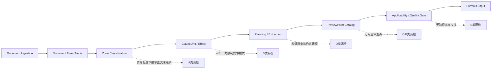

# `agent_review` 漏检问题拆解与最小修复设计 v1

## 目标

基于文件 [SZCG2025000300-A]香港中文大学（深圳）香港中文大学（深圳）教学培训用外科医疗机械人系统项目.docx，整理一版：

- `漏检原因 -> 主链修复点 -> Sprint 开发包`
- 并给出一份可以直接落地的最小修复设计

本设计的目标不是只修这一份文件，而是把这份文件暴露出的漏检模式沉淀成主链能力。

## 一、问题总判断

这批“没有找出”的问题，不是单一故障。

从当前主链看，至少有 5 类不同漏检模式：

1. `已解析到原文，但 zone / clause semantic 判错`
2. `已抽到字段，但没有对应审查点`
3. `需要跨条款一致性比对，当前主链只做逐条抽取`
4. `需要外部知识或本地知识底座，当前系统没有知识校验器`
5. `已进入风险链路，但没有以用户期望的风险粒度单独输出`

因此修复不能只补正则，必须按主链分层修。

## 二、样本问题分组

### A. 资格硬门槛类

样本：

- `10.投标人须为全国科技型中小企业；`
- `11.投标人须具备高新技术企业证书；`
- `12.投标人须提供纳税信用A级证明（提供税务部门出具的证明扫描件）；`
- `13.投标人须成立满5年以上，并提供营业执照复印件；`
- `14.投标人须具备深圳市医疗器械行业同类项目业绩不少于2个（提供合同扫描件）。`

当前表现：

- 原文已进入 `DocumentNode / ClauseUnit`
- 但被打成 `mixed_or_uncertain + unknown_clause`
- 未进入 `qualification` 审查任务族

主链根因：

1. `zone classifier` 过度依赖单句显式词
- 当前更多依赖“资格要求 / 资格条件 / 资质要求”等显式标题词
- 对“资格要求标题下面的编号正文”缺少上下文继承

2. `ClauseUnit` 缺少资格子类型归一
- 没有把“成立年限 / 纳税信用 / 高新资质 / 科技型中小企业 / 地方业绩”归入统一资格门槛骨架

3. `review point catalog` 对资格过严的覆盖不足
- 现在更偏“资格与评分重复设门槛”
- 对“资格条件本身过严或与履约相关性不足”覆盖不够细

### B. 指定机构 / 指定地域 / 指定来源类

样本：

- `投标人须提供深圳市医疗器械检测中心出具的产品检测报告。`
- `投标人须具备深圳市医疗器械行业同类项目业绩不少于2个（提供合同扫描件）。`

当前表现：

- `检测报告` 已被抽取
- `地方同类业绩` 已作为条款被解析到
- 但“指定深圳机构”“限定深圳地区业绩”没有单独形成风险

主链根因：

1. parser 只识别了“检测报告要求”或“业绩要求”
2. 没有进一步识别“指定检测机构 / 指定地方业绩”的限制竞争模式
3. 审查点库缺少“指定本地机构、本地业绩、本地区域资源”专门风险点

### C. 合同费用转嫁 / 担保方式限制类

样本：

- `须以银行转账方式缴纳。合同总价的5%作为质量保证金，质保期满后无息退还。`
- `验收时产生的第三方检测费用由中标人承担，无论检测结果是否合格。`

当前表现：

- 条款已进入合同相关抽取
- 也已部分进入风险证据链
- 但没有形成细粒度独立风险标题

主链根因：

1. 现有合同审查点集中在：
- 扣款
- 解约
- 单方解释
- 验收付款联动

2. 对以下模式缺少独立任务：
- 履约担保提交方式限制
- 履约保证金与质量保证金混用
- 无论检测结果如何均由中标人承担检测费用

### D. 参数冲突 / 约束冲突类

样本：

- `1.6.2.12 设备重量≤500kg(不允许正偏离)`
- `1.6.2.13 设备重量允许±10%偏差`

当前表现：

- 两条技术参数都已抽到
- 但没有形成“参数冲突”风险

主链根因：

1. 当前主链以“逐条抽取”为主
2. 尚未把参数归一成同一约束对象再做冲突比对
3. 缺少 `constraint normalization + consistency checker`

### E. 标准引用 / 检测依据真实性类

样本：

- `产品须符合 GB/T 99999-2024《医疗机器人通用技术规范》要求；`

当前表现：

- 条款已被当作技术要求抽取
- 但不会判断标准是否真实存在、是否适用、是否异常

主链根因：

1. 当前系统没有标准知识底座
2. 在隔离环境下不能依赖临时联网兜底
3. 缺少“标准编号 / 标准名称 / 适用性 / 真伪状态”的本地校验器

### F. 报价门槛 / 非法低价否决类

样本：

- `投标报价不得低于预算金额的80%，低于此价格的投标将被视为无效投标。`

当前表现：

- 原文已被解析到
- 但未形成风险点

主链根因：

1. 现有规则关注“异常低价说明机制”
2. 缺少“以预算比例直接设最低报价门槛”的专项风险点
3. 没有把“预算金额 + 报价阈值 + 无效后果”归一成价格限制约束

## 三、这些问题在主链上分别卡在哪里

## 四、主链修复点

### 1. Parser 层修复

目标：先把条款“看对”。

修复点：

1. `zone context inheritance`
- 当父标题或上游 heading 为：
- `申请人的资格要求`
- `投标人资格要求`
- `一般资格要求`
- `特定资格要求`
- 其下编号条款优先进入 `qualification`

2. `qualification semantic lexicon`
- 为资格条款增加高风险资格门槛词簇：
- `科技型中小企业`
- `高新技术企业`
- `纳税信用`
- `成立满`
- `同类项目业绩不少于`
- `深圳市.*业绩`

3. `constraint-candidate tags`
- parser 不直接定性违法，但要产出约束候选 tag：
- `qualification_hard_gate`
- `locality_restriction_candidate`
- `named_institution_candidate`
- `price_floor_candidate`
- `parameter_constraint_candidate`
- `cost_transfer_candidate`
- `standard_reference_candidate`

### 2. Profile / Planning 层修复

目标：把条款“送进正确任务”。

修复点：

1. `review planning` 增加风险族激活
- `qualification_excess_gate`
- `locality_and_named_source_restriction`
- `contract_cost_transfer`
- `parameter_consistency`
- `standard_reference_validation`
- `price_floor_or_invalid_bid_threshold`

2. `extraction demands` 增加对应字段
- `资格门槛明细`
- `地方性限制信号`
- `指定机构信号`
- `检测费用承担方式`
- `履约担保提交方式`
- `价格门槛条款`
- `技术参数约束明细`
- `标准引用明细`

### 3. Review Point 层修复

目标：把问题“判出来”。

需要新增的最小审查点：

1. `资格条件可能超出必要限度`
- 识别成立年限、纳税信用等级、高新企业、科技型中小企业等门槛

2. `资格条件可能限定地域业绩或行业范围过窄`
- 识别“深圳市同类项目业绩”等地方业绩限制

3. `指定检测机构或特定出具机构`
- 识别“深圳市医疗器械检测中心出具”

4. `履约担保提交方式限制不当`
- 识别“须以银行转账方式缴纳”

5. `履约保证金与质量保证金表述混用`

6. `验收检测费用无差别转嫁给中标人`
- 识别“无论检测结果是否合格”

7. `以预算比例设置最低报价门槛`

8. `同一技术参数约束口径冲突`

9. `标准引用真实性或适用性待核验`
- 输出以 `missing_evidence / manual_review_required` 为主

### 4. Adjudication / Output 层修复

目标：把问题“清楚地说出来”。

修复点：

1. 对知识不足型问题，不强定性
- 标准真伪类默认：
- `missing_evidence`
- `manual_review_required`

2. 对已入证据链但未单独输出的问题，细化 report 粒度
- 允许合同类问题拆成多个独立标题，而不是埋在大类下

3. 给每个问题明确：
- 主证据
- 辅证据
- 风险性质
- 不确定性说明

## 五、按这份文件先做的最小修复设计

这份文件适合先做一个 `MVP 修复包`，目标不是全修，而是让最核心的漏检先闭环。

### MVP-1 资格门槛闭环

范围：

- 第 10-14 条资格门槛

最小改动：

1. `zone_classifier`
- 补资格标题上下文继承

2. `ClauseUnit / extractor`
- 新增 `资格门槛明细` 字段
- 对以下模式打标签：
- `科技型中小企业`
- `高新技术企业`
- `纳税信用A级`
- `成立满X年以上`
- `地方同类项目业绩`

3. `review_point_catalog`
- 新增两个审查点：
- `资格条件可能超出必要限度`
- `资格条件可能限定地域业绩或行业范围过窄`

4. 测试
- 以本文件第 10-14 条为回归样本

预期收益：

- 至少把这 5 条从“完全漏掉”提升为“稳定进入风险候选”

### MVP-2 指定机构 / 检测费用 / 价格门槛闭环

范围：

- `深圳市医疗器械检测中心出具的产品检测报告`
- `验收时产生的第三方检测费用由中标人承担，无论检测结果是否合格`
- `投标报价不得低于预算金额的80%`

最小改动：

1. extractor 增加字段：
- `指定机构信号`
- `检测费用承担方式`
- `价格门槛条款`

2. review point 新增：
- `指定检测机构或特定出具机构`
- `验收检测费用无差别转嫁给中标人`
- `以预算比例设置最低报价门槛`

3. adjudication
- 对指定机构、报价门槛类问题允许直接输出高风险或警示

预期收益：

- 让当前这 3 个明显问题可直接进入报告主结论

### MVP-3 参数冲突与标准待核

范围：

- `设备重量≤500kg(不允许正偏离)`
- `设备重量允许±10%偏差`
- `GB/T 99999-2024`

最小改动：

1. 先不做通用复杂约束图
- 只做“同页 / 同节 / 同参数名”的轻量冲突检查

2. 新增轻量字段：
- `参数名称`
- `参数约束类型`
- `参数数值表达`

3. 新增审查点：
- `同一技术参数约束口径冲突`
- `标准引用真实性或适用性待核验`

4. 输出策略
- 参数冲突可直接预警
- 标准真伪先输出 `manual_review_required`

预期收益：

- 先补最容易被用户感知的“明面冲突”问题

## 六、Sprint 开发包

## Sprint A：资格门槛最小修复包

### 目标

让第 10-14 条进入资格风险主链。

### 任务

1. parser 增加资格标题上下文继承
2. ClauseUnit 增加资格门槛候选 tag
3. extractor 增加 `资格门槛明细`
4. review point 新增：
- `资格条件可能超出必要限度`
- `资格条件可能限定地域业绩或行业范围过窄`
5. 针对本文件补回归测试

### 验收

- 第 10-14 条至少命中 2 个以上正式 review point
- 不再停留在 `mixed_or_uncertain + unknown_clause`

## Sprint B：限制竞争与合同负担最小修复包

### 目标

补“指定机构、检测费用、担保方式、价格门槛”这组高感知问题。

### 任务

1. extractor 增加：
- `指定机构信号`
- `检测费用承担方式`
- `履约担保提交方式`
- `价格门槛条款`

2. review point 新增：
- `指定检测机构或特定出具机构`
- `履约担保提交方式限制不当`
- `验收检测费用无差别转嫁给中标人`
- `以预算比例设置最低报价门槛`

3. reporting / adjudication 粒度细化

### 验收

- 上述 4 类问题能在报告中以独立标题出现

## Sprint C：一致性与知识校验最小修复包

### 目标

补参数冲突和标准待核。

### 任务

1. 新增轻量 `constraint normalization`
2. 新增参数冲突检查器
3. 新增标准引用解析器
4. 对标准真实性不足输出 `manual_review_required`

### 验收

- `≤500kg` 与 `±10%偏差` 能形成冲突预警
- `GB/T 99999-2024` 能进入“待核验”问题，而不是静默通过

## Sprint D：未知问题兜底主链

### 目标

不是只修这份文件，而是让下一份未知文件也能兜住类似问题。

### 任务

1. 建立 `constraint tags -> risk family` 路由
2. 将低置信度候选优先交给 parser LLM assist
3. 为 unknown 路由增加：
- `named_source`
- `cost_transfer`
- `parameter_conflict`
- `price_floor`
- `standard_reference`
4. 增加真实未知样本回归集

### 验收

- 新文件即便没有明确规则，也能把类似问题送到正确风险族

## 七、未知问题的总体解决方案

对未知问题，最优方案不是“全交给 LLM”，而是：

`规则主链 + 结构画像 + 约束归一 + 风险族路由 + LLM 小范围补偿 + 人工升级出口`

具体来说：

1. parser 主体负责稳定结构化，不依赖 LLM
2. planning 负责把未知条款送到正确风险族
3. review point 负责覆盖已知高频风险模式
4. consistency checker 负责发现跨条款冲突
5. LLM 只处理：
- 低置信度歧义消解
- 未知条款的风险语义解释
- 证据不足但疑似高风险的补充归类
6. 无法闭合证据链时，必须输出：
- `missing_evidence`
- `manual_review_required`

## 八、推荐实施顺序

1. 先做 `Sprint A`
- 因为这能直接修复当前文件里最显著的 10-14 条漏检

2. 再做 `Sprint B`
- 因为指定机构、费用转嫁、价格门槛属于高感知、高价值问题

3. 接着做 `Sprint C`
- 因为参数冲突和标准待核需要轻量约束层支撑

4. 最后做 `Sprint D`
- 把这次修复沉淀成未知文件通用兜底能力

## 九、这版设计的边界

这版是“最小修复设计”，不是完整重构。

本版优先解决：

- 资格门槛漏检
- 指定机构漏检
- 检测费用转嫁漏检
- 报价门槛漏检
- 参数冲突未识别
- 标准待核未输出

本版暂不追求：

- 完整通用知识图谱
- 全量法律自动定性
- 所有参数类型的复杂符号运算
- 所有标准编号的离线真伪库

后续应在 Sprint C/D 基础上逐步扩展。
