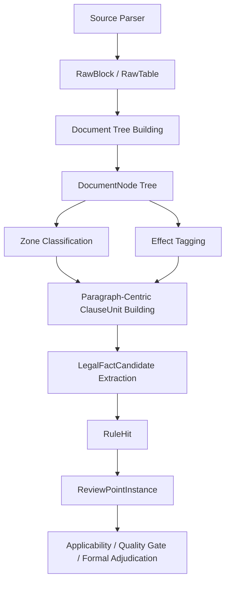

# 《agent_review parser 段落树主导方案 v2》

## 1. 核心结论

`agent_review` 的 parser 主体应当明确收敛为：

`RawBlock/RawTable -> DocumentNode(Tree) -> SemanticZone -> EffectTag -> ClauseUnit -> LegalFactCandidate`

其中最关键的设计原则不是“按句解析”，也不是“按行扫描”，而是：

- 先恢复文档的段落/表格/标题结构
- 再建立章节树和段落归属
- 最后在段落上下文内生成 `ClauseUnit`

也就是说，`ClauseUnit` 的正确上游应该是“段落树”，而不是“全文行文本”。

## 2. 为什么必须是段落树主导

政府采购招标文件不是普通文章，而是“带法律效力分层的规则包”。同一句话，落在不同结构位置，含义完全不同。

例如：

- “提供检测报告”
  - 在 `qualification` 下，可能是资格材料门槛
  - 在 `technical` 下，可能是技术证明方式
  - 在 `scoring` 下，可能是加分项
  - 在 `template` 下，可能只是投标文件格式示例

- “本项目仍适用价格扣除”
  - 在政策说明段里，可能是项目事实绑定
  - 在声明函模板里，可能只是模板残留

- “同类业绩不少于2个”
  - 在资格章节里，是准入门槛
  - 在评分章节里，是评分因素
  - 在附件说明里，可能根本不形成正式约束

因此 parser 不能直接把全文切碎后做关键词解释，必须先知道：

- 这句话属于哪个段落
- 这个段落挂在哪个标题下面
- 这个段落是正文、表格行、模板、附件还是目录
- 这个段落在当前章节中是否具有正式约束效力

## 3. v2 主链模型

### 3.1 结构层

结构层负责恢复“文档长什么样”：

- `RawBlock`
  - 原始段落块、列表项、页内文本块
- `RawTable`
  - 原始表格
- `DocumentNode`
  - 树节点，包含章节、段落、表格、表格行、附件节点

输出重点：

- 段落边界
- 标题层级
- 表格与表格行
- 段落所在路径 `path`
- 锚点 `anchor`

### 3.2 语义层

语义层负责回答“这个段落属于哪个审查区、具有什么效力”：

- `SemanticZone`
  - 资格 / 技术 / 商务 / 评分 / 合同 / 模板 / 附件 / 政策说明 / 无关内容
- `EffectTag`
  - binding / template / example / reference_only / catalog / noise

### 3.3 单元层

单元层负责回答“在当前段落上下文里，什么才是可被审查的最小语义单元”：

- `ClauseUnit`
  - 不等于句子
  - 也不等于整段
  - 而是“段落树上下文中的最小约束单元”

`ClauseUnit` 生成原则：

- 默认以段落或表格行为主
- 只有在段落内部同时承载多个独立法律效果时，才允许再拆
- 拆分必须保留：
  - 父标题路径
  - zone
  - effect
  - row/title context

### 3.4 事实层

事实层负责把 `ClauseUnit` 映射为稳定的法律事实对象：

- `LegalFactCandidate`

这层才是真正供：

- `RuleHit`
- `ReviewPointInstance`
- `Applicability`
- `FormalAdjudication`

消费的统一事实输入。

## 4. 段落树主导，不等于“只按段落不拆”

v2 方案不是简单地说“以后只按段落”，而是：

- 结构恢复以段落为基础
- 语义解释以段落归属为前提
- 单元生成允许必要的段内细分

可接受的细分场景：

- 一个段落里并列列出多个资格门槛
- 一个表格行里同时出现“评分对象 + 分值 + 条件”
- 一个政策段同时出现“条件分支 + 项目绑定结论”

不应再出现的错误思路：

- 仅按行号扫描全文
- 仅按关键词命中后直接定 zone
- 仅按句号或分号拆句后直接做法律判断

## 5. 目标架构图

## 6. 当前代码实现状态审计

下面按“已经具备段落树思维 / 仍偏按行思维”拆分。

### 6.1 已具备段落树思维的部分

#### A. 原始块与树构建主链

对应模块：

- [tree_builder.py](/Users/linzeran/code/2026-zn/agent_review/src/agent_review/structure/tree_builder.py)
- [docx_parser.py](/Users/linzeran/code/2026-zn/agent_review/src/agent_review/parsers/docx_parser.py)
- [models.py](/Users/linzeran/code/2026-zn/agent_review/src/agent_review/models.py)

当前状态：

- 已有 `RawBlock`、`RawTable`、`DocumentNode`
- 已把标题、段落、表格、表格行纳入树
- 已保留 `path`、`anchor`、`paragraph_no`
- 已把内联表格、附件、目录项做成独立节点

判断：

- 这一层已经是“段落树主导”的正确方向
- 后续不是推翻重做，而是继续增强 heading/section 识别精度

#### B. zone / effect / ClauseUnit 主链

对应模块：

- [zone_classifier.py](/Users/linzeran/code/2026-zn/agent_review/src/agent_review/structure/zone_classifier.py)
- [effect_tagger.py](/Users/linzeran/code/2026-zn/agent_review/src/agent_review/structure/effect_tagger.py)
- [clause_units.py](/Users/linzeran/code/2026-zn/agent_review/src/agent_review/extractors/clause_units.py)

当前状态：

- `ClauseUnit` 直接消费 `DocumentNode`
- `ClauseUnit` 已保留 `path`、`anchor`、`table_context`
- 表格行和普通段落走不同 profile
- 条件政策上下文已经开始依赖节点上下文而不是纯字符串

判断：

- 这部分已经是 v2 主链核心
- 应继续抬升其在 parser 中的中心地位

#### C. 法律事实主链

对应模块：

- [legal_facts.py](/Users/linzeran/code/2026-zn/agent_review/src/agent_review/extractors/legal_facts.py)

当前状态：

- `LegalFactCandidate` 已优先消费 `ClauseUnit`
- 已开始做 fact zone 归一化
- 已把政策、评分、合同、证明来源等语义从旧 clause 文本链迁到事实层

判断：

- 事实层已经和段落树主链接通
- 但仍保留全文 fallback，需要继续收口

### 6.2 仍然偏“按行思维”的部分

#### A. 旧 `ExtractedClause` fallback 抽取器

对应模块：

- [clauses.py](/Users/linzeran/code/2026-zn/agent_review/src/agent_review/extractors/clauses.py)

主要表现：

- `extract_clauses(text)` 先 `splitlines()`
- 大量 extractor 以 `for line_no, line in enumerate(lines, start=1)` 为核心
- 许多字段仍是“整行命中 -> 生成 clause”
- 锚点仍大量依赖 `line:{n}`

判断：

- 这是当前最典型的“按行思维”残留区
- 现在虽然有 `extract_clauses_from_units(...)`，但 fallback 仍很强势

结论：

- `clauses.py` 应从“按行扫描器”逐步改成“基于 ClauseUnit/ParagraphNode 的字段归一器”

#### B. `legal_facts` 的全文 fallback

对应模块：

- [legal_facts.py](/Users/linzeran/code/2026-zn/agent_review/src/agent_review/extractors/legal_facts.py)

主要表现：

- 仍保留 `_extract_fallback_facts_from_text(raw_text)`
- 使用 `raw_text.splitlines()`
- `fallback-line:{n}` 仍然是重要兜底路径

判断：

- 这是现阶段必要兜底
- 但从架构目标看，它不应是长期主链

结论：

- 后续应改造成 `fallback_from_orphan_nodes`，优先基于未归一的 `DocumentNode`，而不是全文按行

#### C. `risk_rules` 旧规则链

对应模块：

- [risk_rules.py](/Users/linzeran/code/2026-zn/agent_review/src/agent_review/rules/risk_rules.py)

主要表现：

- 直接 `text.splitlines()`
- 全文逐行匹配旧风险点
- 证据锚点是 `line:{n}`

判断：

- 这是旧主链遗留，不属于 v2 parser 思路
- 它可以短期保留为回归安全网，但不应该继续承担中心职责

结论：

- 应逐步把高频规则迁到 `LegalFactCandidate -> RuleHit -> ReviewPointInstance`
- 旧 `risk_rules` 只保留为回归补位和对照集

#### D. `document_structure.locate_sections`

对应模块：

- [document_structure.py](/Users/linzeran/code/2026-zn/agent_review/src/agent_review/structure/document_structure.py)

主要表现：

- 仍以 `text.splitlines()` 和章节关键词扫行定位

判断：

- 这会导致章节定位和真实树结构双轨并存

结论：

- `SectionIndex` 应逐步改成从 `DocumentNode Tree` 反推生成
- 而不是再从纯文本二次扫一遍

#### E. `quality` / `consistency` 中的文本窗口函数

对应模块：

- [quality.py](/Users/linzeran/code/2026-zn/agent_review/src/agent_review/quality.py)
- [consistency/checks.py](/Users/linzeran/code/2026-zn/agent_review/src/agent_review/consistency/checks.py)

主要表现：

- 多处仍对原文 `splitlines()`
- 通过行窗回捞上下文

判断：

- 这是典型“树外补窗”

结论：

- 后续应优先从 `anchor -> node -> parent context` 取证据窗
- 少依赖全文行窗

#### F. `pipeline.build_parse_result_for_text`

对应模块：

- [pipeline.py](/Users/linzeran/code/2026-zn/agent_review/src/agent_review/pipeline.py)

主要表现：

- 文本直输模式仍是按行构造 `RawBlock`

判断：

- 对 `.txt` 或 OCR 扁平输入来说，这一步短期无法避免
- 但语义上这只是“退化段落模型”，不是真正的段落树

结论：

- 要把它明确标注为 `plain_text_degraded_mode`
- 不能把它和 `docx/pdf` 的结构化 parser 等同看待

## 7. 现阶段的总体判断

一句话总结：

`agent_review` 的主链方向已经是“段落树主导”，但仍有几条重要补位支路停留在“按行思维”。当前问题不是没有树，而是“树主链还不够彻底，行级 fallback 还太强”。

更具体地说：

- parser 主骨架：方向正确
- ClauseUnit 主链：方向正确
- LegalFact 主链：已经开始成型
- ExtractedClause / risk_rules / section locate / quality window：仍需收口

## 8. 下一步收口优先级

### P0. 把 `ExtractedClause` fallback 从“按行”改成“按节点/按段落”

目标：

- `extract_clauses(text)` 降权
- `extract_clauses_from_units(...)` 成为绝对主入口
- 旧字段抽取器逐步改造成“从 `ClauseUnit` 归一字段”

### P1. 把 `legal_facts` fallback 从全文按行改成 orphan node fallback

目标：

- 不再直接 `raw_text.splitlines()`
- 改成消费未充分结构化的 `DocumentNode`
- 兜底仍保留，但也留在树内

### P2. 把 `SectionIndex` 改成树派生对象

目标：

- 由 `DocumentNode` 标题节点生成章节索引
- 取消“纯文本章节关键词扫行”双轨逻辑

### P3. 把 `quality` / `formal` 的上下文回捞改成 anchor->node->context

目标：

- 证据窗来自树上下文
- 少做全文行窗拼接

### P4. 继续削弱 `risk_rules.py`

目标：

- 高频风险点全部迁到 `LegalFactCandidate -> RuleHit`
- `risk_rules.py` 仅保留为对照兜底和回归报警

## 9. v2 落地口径

后续所有 parser 相关开发，应统一按下面口径判断是否“符合 v2”：

- 是否先建立段落/表格块
- 是否把块挂入文档树
- 是否在树上下文中做 zone/effect
- 是否由段落树生成 `ClauseUnit`
- 是否由 `ClauseUnit` 生成事实
- 是否尽量避免直接按全文行文本做审查判断

如果某个实现仍然是：

- `splitlines()`
- 逐行关键词扫描
- 直接按行输出审查证据

那它最多只能算“过渡 fallback”，不能算 parser v2 主链实现。

## 10. 对当前仓库的建议结论

当前不建议重写 parser。

建议做法是：

- 保留现有 `RawBlock -> DocumentNode -> ClauseUnit` 主链
- 明确其为 parser 唯一目标主链
- 把所有旧“按行思维”模块逐步改造成：
  - 树内 fallback
  - 节点归一器
  - 事实补位器

也就是说，接下来不是“再设计一条新 parser”，而是“让当前 parser 真正完成从行级补位架构到段落树主导架构的收口”。
